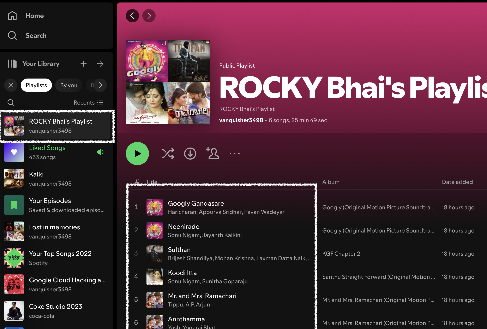

# spotify_terraform
Manage Spotify using Terraform

## Requirements
- Terraform
- Spotify API credentials

Create a Spotify application and get the client id and client secret from the Spotify Developer Dashboard.
https://developer.spotify.com/dashboard

And in the redirection URL add `http://localhost:27228/spotify_callback`

## Usage
1. Clone the repository

2. Create a `terraform.tfvars` file with the following content:
```
spotify_api_key = "your_spotify_api_key"
```

3. Create an .env file weith the following content:
```
SPOTIFY_CLIENT_ID=your_spotify_client_id
SPOTIFY_CLIENT_SECRET=your_spotify_client_secret
```

4. Run an authentication proxy server:
```
docker run --rm -it -p 27228:27228 --env-file ./.env ghcr.io/conradludgate/spotify-auth-proxy
```

5. Open the URL shown in the output

6. Authorize the application

7. Copy the code and paste it in the terminal

8. Run `terraform plan` and `terraform apply`

9. Enjoy!


## Results
- A playlist will be created with the name `ROCKY Bhai's Playlist`
- The playlist will be populated with the top 6 tracks of the artist `Yash`




## Clean up
Run `terraform destroy` to delete the playlist and the tracks